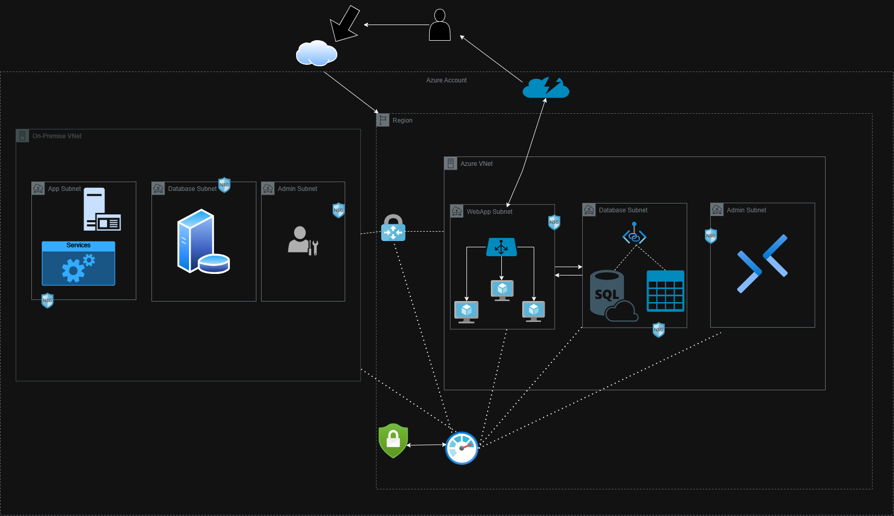

# CloudSecureNet - Hybrid Network With Azure

**Project Overview:**  
CloudSecureNet is a hybrid cloud networking project that connects on-premises environments to Azure resources securely using Azure's networking capabilities. This project emphasizes secure data transitions and effective resource access controls.

## Key Features
- **Hybrid Architecture:** Simulates a seamless connection between on-premises networks and Azure.
- **Security:** Utilizes Azure VPN Gateway, NSGs, and Bastion for secure resource access.
- **Performance Monitoring:** Implements load balancing and diagnostics for network health.

## Azure Services Used
- Azure Virtual Networks
- Azure VPN Gateway
- Network Security Groups (NSGs)
- Azure Bastion
- Azure Private Link
- Azure DNS
- Azure Load Balancer

## Architecture Diagram

## Steps to Implement
1. **Azure Virtual Network Setup**  
   Provision an Azure Virtual Network (VNet) with multiple subnets.
  
2. **On-Premises Network Simulation**  
   Create a second VNet to simulate your on-premises environment.
  
3. **Secure Connectivity**  
   Establish a site-to-site VPN connection between the VNets.
  
4. **Resource Deployment**  
   Deploy VMs in each subnet for testing.
  
5. **Network Access Control**  
   Define access rules with NSGs.
  
6. **Secure Administrative Access**  
   Use Azure Bastion for RDP and SSH.
  
7. **Private Access to Azure PaaS**  
   Access Azure PaaS services via Private Link.
  
8. **DNS and Load Balancing**  
   Configure Azure DNS and implement a Load Balancer.
  
9. **Performance Testing**  
   Conduct tests to validate performance and security.
  
10. **Monitoring and Auditing**  
    Enable monitoring and review logs for security insights.

## Getting Started
### Prerequisites
- Azure subscription
- Basic understanding of Azure networking concepts
- Admin access to configure VPN gateways and networks

### Installation
1. Clone the repository:  
   `git clone https://github.com/yourusername/CloudSecureNet.git`
   
2. Navigate to the directory:  
   `cd CloudSecureNet`

3. Follow the instructions in `docs/performance_testing_report.md` for testing.

## License
This project is licensed under the MIT License - see the [LICENSE](LICENSE) file for details.

## Contact
For inquiries, please contact me on [GitHub](github.com/naszemade)

## Steps to Set Up the Project
1. [Azure Virtual Network Setup](./docs/1-azure-vnet-setup.md)
2. [On-Premises Network Simulation](./docs/2-on-premises-simulation.md)
3. [Secure Connectivity using VPN Gateway](./docs/3-secure-connectivity.md)
4. [Resource Deployment](./docs/4-resource-deployment.md)
5. [Network Access Control with NSGs](./docs/5-network-access-control.md)
6. [Secure Administrative Access with Azure Bastion](./docs/6-secure-access.md)
7. [Private Access to PaaS Services using Azure Private Link](./docs/7-private-access.md)
8. [DNS and Load Balancing Configuration](./docs/8-dns-load-balancer.md)
9. [Performance and Security Testing](./docs/9-testing.md)
10. [Monitoring and Auditing](./docs/10-monitoring-auditing.md)

## Requirements
- Azure subscription
- Basic knowledge of Azure networking services

## License
[MIT License](./LICENSE)
